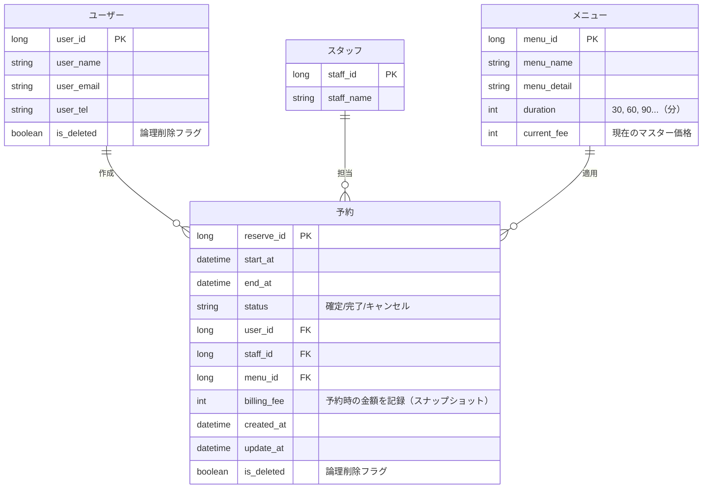

# 画面イメージ
- ユーザー
  - ログイン画面
    - ＩＤ＆パスワード
  - トップ画面
    - 新規予約ボタン、予約履歴一覧ボタン
  - 新規予約画面
    - メニュー選択→スタッフ別orスタッフ全員の空き状況の確認カレンダー→予約日時選択→予約最終確定画面
  - 予約履歴一覧画面
    - 過去の予約一覧（日付とその時のメニューと担当スタッフ）→同じメニューを選択できるボタン→予約日時選択→予約最終確定画面

- スタッフ
  - ログイン画面
    - ＩＤ＆パスワード
  - トップ画面
    - 予約一覧カレンダー確認ボタン、お客様一覧、メニュー一覧
  - 予約一覧カレンダー確認画面
    - 一覧から特定の予約をクリックで予約詳細編集画面へ
  - お客様一覧確認画面
    - 一覧から特定のお客様クリックでお客様詳細編集画面へ
  - メニュー一覧
    - 一覧から特定のメニューでメニューの詳細編集画面へ

## E-R図

